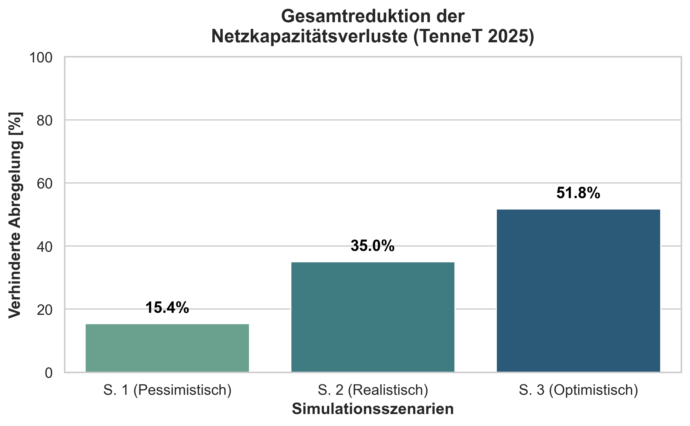
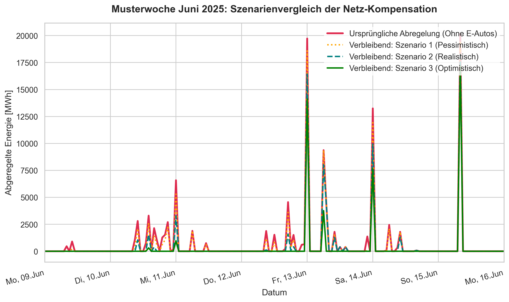
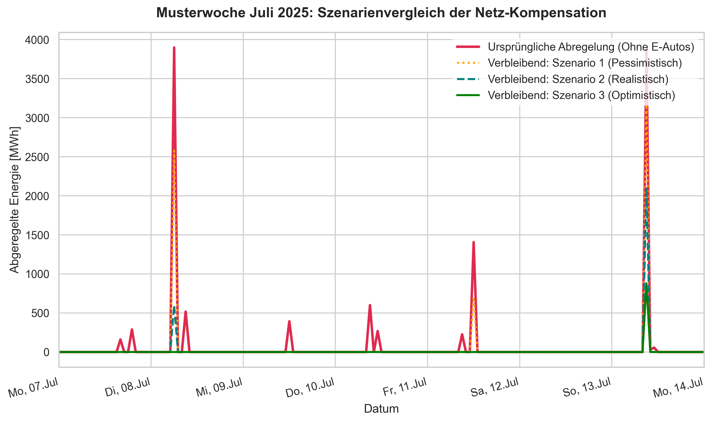
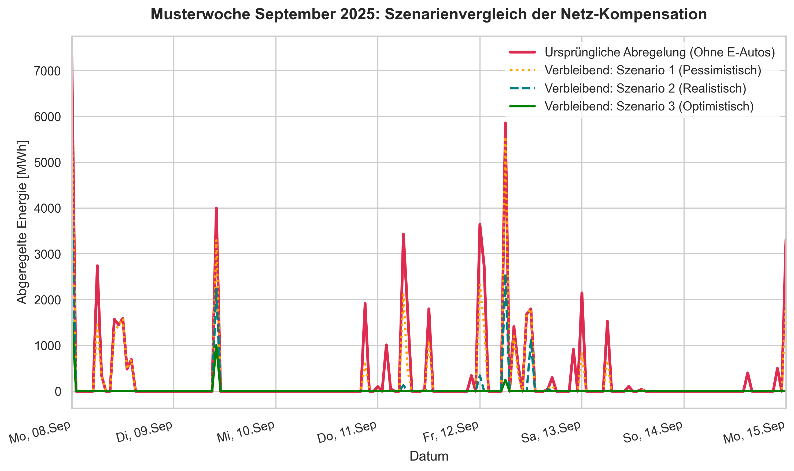
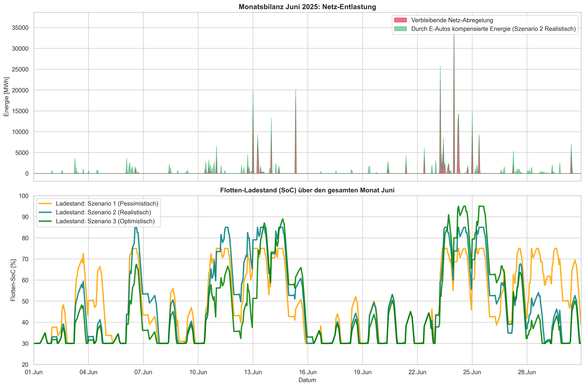
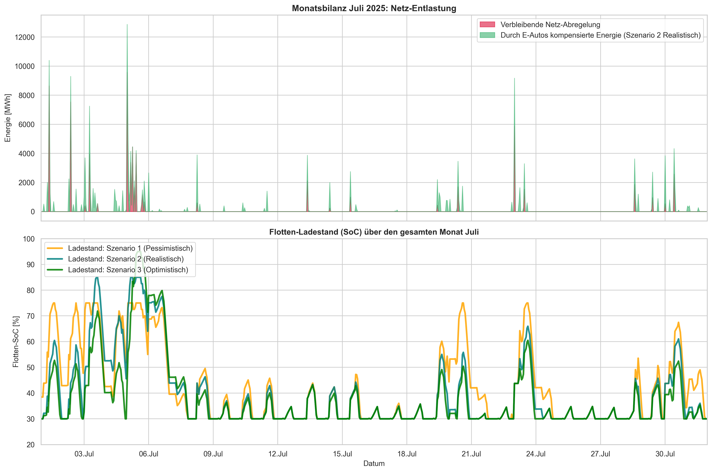
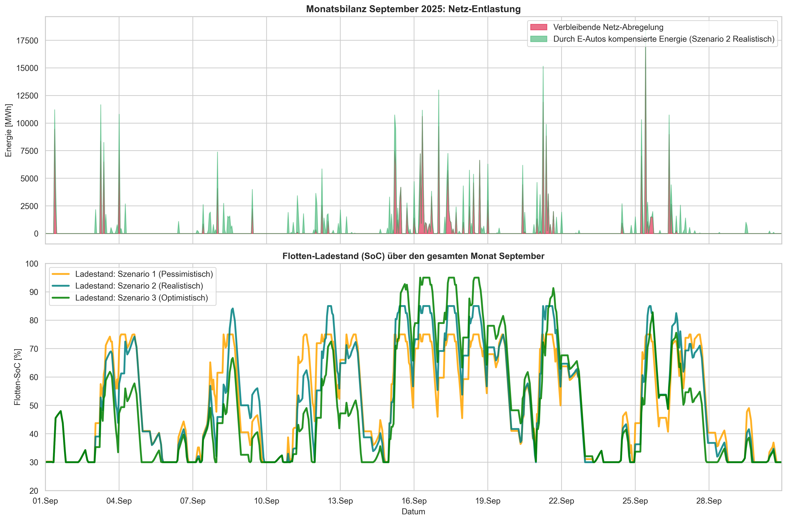

# Wissenschaftliche Dokumentation: Simulationsmodell zur Netzentlastung durch Elektromobilität (V2G & Smart Charging)

Diese Dokumentation beschreibt die wissenschaftlichen Grundlagen, die mathematische Modellierungslogik und die Szenarienkonfiguration des Simulationsskripts `sim.py`. Das Modell evaluiert das quantitative Potenzial einer gesteuerten Lade- und Rückspeisestrategie (Vehicle-to-Grid, V2G) einer Flotte von 800.000 Elektrofahrzeugen (EVs) zur Reduktion von Redispatch-bedingten Abregelungsmaßnahmen im Übertragungsnetz der TenneT DE für das Jahr 2025.

---

## 1. Szenarienkonfiguration und -analyse

Das Modell evaluiert drei differenzierte Szenarien, die sich in drei zentralen Parametern unterscheiden: der **Akzeptanz- bzw. Teilnahmequote (Acceptance Rate)** der Fahrzeughalter am gesteuerten Laden/V2G, dem **maximal zulässigen Ladestand (Maximum State of Charge, $SoC_{max}$)** im alltäglichen Betrieb und den freigegebenen Lade-/Entladeleistungen. Das Flottenpotenzial basiert auf einer Bezugsgröße von $N = 800.000$ Elektrofahrzeugen im TenneT-Netzgebiet mit einer durchschnittlichen Batteriekapazität von $E_{bat} = 60\text{ kWh}$. 

Die Wahl einer durchschnittlichen Kapazität von $60\text{ kWh}$ bewegt sich im empirisch fundierten Korridor für Flottenanalysen im mittelfristigen Zeithorizont, da im Zuge des Markthochlaufs mit einem kontinuierlichen Anstieg der Netto-Kapazitäten gerechnet wird (vgl. Blumberg et al., 2022, die für 2030 eine durchschnittliche europäische Flottenkapazität von $75\text{ kWh}$ projektieren).

### Übersicht der Simulationsergebnisse und Parameter (Jahresbilanz)

| Parameter / Ergebnis                        | Szenario 1: Pessimistisch | Szenario 2: Realistisch | Szenario 3: Optimistisch |
|:--------------------------------------------|:-------------------------:|:-----------------------:|:------------------------:|
| **Teilnahmequote (Acceptance Rate)**        |           20 %            |          50 %           |           85 %           |
| **Aktive Fahrzeuge ($N_{active}$)**         |          160.000          |         400.000         |         680.000          |
| **Maximaler SoC ($SoC_{max}$)**             |           75 %            |          85 %           |           95 %           |
| **Minimaler Sicherheits-SoC ($SoC_{min}$)** |           30 %            |          30 %           |           30 %           |
| **Max. Ladeleistung pro Fahrzeug**          |       11,0 kW (AC)        |      11,0 kW (AC)       |       11,0 kW (AC)       |
| **Max. V2G-Rückspeiseleistung**             |      4,0 kW (DC/AC)       |     4,0 kW (DC/AC)      |      4,0 kW (DC/AC)      |
| **Verfügbare Flottenkapazität**             |         9.600 MWh         |       24.000 MWh        |        40.800 MWh        |
| **Gerettete Energie [MWh]**                 |       742.861,0 MWh       |     1.684.821,2 MWh     |     2.490.284,9 MWh      |
| **Ursprüngliche Abregelung**                |      4.809.408,4 MWh      |     4.809.408,4 MWh     |     4.809.408,4 MWh      |
| **Prozentuale Einsparung**                  |        **15,45 %**        |       **35,03 %**       |       **51,78 %**        |

#### Grafischer Szenarienvergleich (Jahresbilanz)

### Detaillierte Charakterisierung der Szenarien

#### Szenario 1: Pessimistisch (Low-Compliance / Restriktiver Betrieb)
* **Begründung:** Dieses Szenario modelliert eine ausgeprägte Zurückhaltung auf dem Endverbrauchermarkt. Die Mehrheit der Nutzer verweigert die Freigabe des Fahrzeugs für Netzdienstleistungen aus Sorge vor zyklischer Batteriealterung oder unzureichender Reichweitenreserve.
* **Technische Restriktion:** Ein $SoC_{max}$ von 75 % schränkt das nutzbare Flexibilitätsfenster massiv ein, da der nutzbare Hub zwischen dem minimalen Sicherheits-SoC (30 %) und dem Maximum stark gestaucht ist ($45\%$ der Gesamtkapazität). 
* **Ergebnis:** Trotz der restriktiven Parameter können bereits über 742 GWh an erneuerbarem Strom ins System integriert werden, was die systemische Relevanz von Kleinstspeichern unterstreicht.

#### Szenario 2: Realistisch (Mid-Compliance / Optimierter Standardbetrieb)
* **Begründung:** Angenommen wird eine regulatorische Reife: Dynamische Stromtarife und attraktive V2G-Prämien der Übertragungsnetzbetreiber (ÜNB) incentivieren die Hälfte aller EV-Halter zur Teilnahme.
* **Technische Restriktion:** Ein $SoC_{max}$ von 85 % spiegelt die gängigen Herstellerempfehlungen zur Schonung von Lithium-Ionen-Zellen (Vermeidung von kalendarischer Alterung im oberen Spannungsplateau) wider, stellt aber gleichzeitig ein breites Speicherfenster ($55\%$ Hub) bereit.
* **Ergebnis:** Mit einer Reduktion um **35,03 %** wird mehr als ein Drittel des abgeregelten Stroms kompensiert. Dieses Szenario gilt als energiewirtschaftlicher Zielkorridor für das Jahr 2025/2026.

#### Szenario 3: Optimistisch (High-Compliance / Maximaler Flexibilitätshub)
* **Begründung:** Vollständige Marktdurchdringung, automatisierte Aggregation über virtuelle Kraftwerke (Virtual Power Plants, VPP) und gesetzlich standardisierte V2G-Schnittstellen bei allen Neuzulassungen.
* **Technische Restriktion:** Ein Ausreizen des $SoC_{max}$ auf 95 % maximiert die energetische Absorptionsfähigkeit ($65\%$ Hub). Dies setzt hochentwickelte Batteriemanagementsysteme (BMS) voraus, die Degradationseffekte minimieren.
* **Ergebnis:** Mehr als die Hälfte (**51,78 %**) der gesamten Abregelungsarbeit im TenneT-Netz wird absorbiert.

---

## 2. Empirische und Studienbasierte Grundlagen

Die im Algorithmus verwendeten Parameter sind keine fiktiven Annahmen, sondern orientieren sich an empirischen Erhebungen der deutschen Mobilitäts- und Energieforschung:

### 2.1 Wallbox-Verfügbarkeitsfaktor (`avail_factor`)
Die zeitabhängige Verfügbarkeit spiegelt die physische Netzanbindung der Fahrzeuge wider:
* **Tagesfenster (08:00 - 16:00 Uhr) = 40 %:** Basiert auf der Annahme, dass sich ein Teil der Fahrzeuge im Pendelverkehr befindet oder am Arbeitsplatz ohne Ladeinfrastruktur abgestellt ist. 
* **Nacht-/Abendfenster (16:00 - 08:00 Uhr) = 75 %:** Basiert auf empirischen Daten der repräsentativen Panelstudie **"Mobilität in Deutschland" (MiD)** des Bundesministeriums für Digitales und Verkehr (BMDV). Die MiD-Daten zeigen, dass private Pkw im Durchschnitt über 23 Stunden am Tag ungenutzt stillstehen, wobei die Standwahrscheinlichkeit am privaten Wohnort ab 17:00 Uhr sprunghaft auf über 70–80 % ansteigt. Das Modell gleicht in jedem Zeitschritt $t$ die Schnittmenge aus der zeitgleichen Abregelungsmenge und diesem Verfügbarkeitsfaktor mathematisch ab.

### 2.2 Mobilitätsbedingte Entladung (`driving_discharge`)
* **Verbrauch von 1,5 kW zu Stoßzeiten (7, 8, 16, 17 Uhr):** Entspricht dem mittleren stündlichen Energiebedarf einer Flotte während der Hauptverkehrszeiten. Bei einem durchschnittlichen Realverbrauch moderner EVs von ca. 18–20 kWh/100 km impliziert dieser Wert eine Fahrleistung von etwa 7,5 bis 8 km pro Fahrzeug in dieser Pendlerstunde – ein Wert, der exakt mit den mittleren Pendlerdistanzen des *Instituts für Arbeitsmarkt- und Berufsforschung (IAB)* korreliert.

### 2.3 V2G-Rückspeiseleistung (`v2g_discharge`)
* **Rückspeisung von 4,0 kW (18:00 - 23:00 Uhr):** Diese zeitliche Festlegung entspricht der **Abendspitze der Residuallast** im deutschen Stromnetz (Kombination aus einbrechender PV-Erzeugung und steigender Haushaltsnachfrage). Die Begrenzung auf 4,0 kW pro Fahrzeug berücksichtigt die thermischen und elektrischen Restriktionen im Niederspannungsnetz sowie die typische Leistungsbegrenzung gängiger bidirektionaler DC/AC-Wallboxen im Heimbereich (meist gedeckelt auf 4 bis 11 kW, um Schieflasten im Verteilnetz zu vermeiden).

---

## 3. Mathematische Modellierung und Berechnungsalgorithmus

Das Simulationsskript `sim.py` implementiert ein **zeitdiskretes, deterministisches Zustandsraummodell** mit einer zeitlichen Auflösung von $\Delta t = 1\text{ Stunde}$ für ein vollständiges Kalenderjahr ($T = 8760\text{ h}$).

### 3.1 Definition der Zustandsvariablen

Für jeden Zeitschritt $t \in [1, 8760]$ ist der Systemzustand definiert durch:
* $E_{fleet} = N \cdot \text{acceptance\_rate} \cdot 60.0 \text{ kWh} / 1000 \quad [\text{MWh}]$ (Gesamtkapazität der aktiven Flotte)
* $SoC_t \in [SoC_{min}, SoC_{max}] \quad [-]$ (Relativer Ladestand der Flotte im Schritt $t$)
* $P_{avail, t} = \text{avail\_factor}_t \quad [-]$ (Prozentuale Netzanbindung der Flotte)

### 3.2 Schritt-für-Schritt Berechnungslogik

Die mathematische Abbildung der Lade- und Netzentnahmebilanzen orientiert sich methodisch an etablierten techno-ökonomischen Systemmodellen für großskalige EV-Flottenanalysen (vgl. Blumberg et al., 2022). Die Kopplung zwischen Fahrleistung, Netzentnahme und aggregierter Gleichzeitigkeit folgt dabei einer analogen formalen Logik.

#### Schritt 1: Uncontrolled / Smart Solar Charging
Vor der Interaktion mit dem Redispatch-Signal nimmt die Flotte Energie über photovoltaische Erzeugung auf. Die Intensität korreliert mit der normierten deutschlandweiten PV-Erzeugung:
$$SoC_{t, \text{solar}} = SoC_{t-1} + \frac{N_{active} \cdot P_{solar\_charge} \cdot P_{avail, t} \cdot \gamma_{solar, t} \cdot \Delta t}{E_{fleet}}$$
*Wobei:*
* $P_{solar\_charge} = 2.0 \text{ kW}$ (Mittlere solarinduzierte Ladeleistung pro Fahrzeug)
* $\gamma_{solar, t} = \frac{\text{PV\_Erzeugung}_t}{\max(\text{PV\_Erzeugung})} \in [0, 1]$ (Relative Solar-Intensität)

Der resultierende Zustand wird hart nach oben begrenzt:
$$SoC_{t, \text{solar}} = \min(SoC_{max}, SoC_{t, \text{solar}})$$

#### Schritt 2: Redispatch-Energiestrom-Absorption
Das mathematische Potenzial zur Rettung abzuregelnder Energie ($P_{saved, t}$) wird durch drei physikalische Barrieren limitiert: das Angebot der Abregelung, die maximale Ladeleistung der Netzanbindungen und die freie energetische Restkapazität der Batterien. In Übereinstimmung mit Modellen zur ungesteuerten Lastspitzen- und Koinzidenzermittlung (Blumberg et al., 2022) wird die maximal abrufbare Ladeleistung pro Zeitschritt zeitabhängig durch die Anzahl real angeschlossener Fahrzeuge begrenzt:

$$P_{charge\_max, t} = \frac{N_{active} \cdot 11.0 \text{ kW} \cdot P_{avail, t}}{1000} \quad [\text{MWh}]$$
$$E_{free, t} = E_{fleet} \cdot (SoC_{max} - SoC_{t, \text{solar}}) \quad [\text{MWh}]$$
$$E_{saved, t} = \min\left(\text{Abregelung}_{t}, \, P_{charge\_max, t} \cdot \Delta t, \, E_{free, t}\right)$$

#### Schritt 3: Flotten-Entladungsbilanz (Fahrprofil & V2G)
Die energetische Entnahme setzt sich zusammen aus dem Fahrverbrauch ($E_{drive, t}$) und der bewussten Rückspeisung ins Netz zur Residuallastdeckung ($E_{v2g, t}$):
$$E_{drive, t} = \begin{cases} \frac{N_{active} \cdot 1.5 \text{ kW} \cdot \Delta t}{1000} & \text{für } t_{hour} \in \{7, 8, 16, 17\} \\ 0 & \text{sonst} \end{cases}$$
$$E_{v2g, t} = \begin{cases} \frac{N_{active} \cdot 4.0 \text{ kW} \cdot P_{avail, t} \cdot \Delta t}{1000} & \text{für } 18 \le t_{hour} \le 23 \\ 0 & \text{sonst} \end{cases}$$
$$\text{Total\_Discharge}_t = E_{drive, t} + E_{v2g, t}$$

#### Schritt 4: Endgültiges SoC-Update per Sättigungsfunktion
Der finale Ladestand für den nächsten Zeitschritt wird berechnet und mittels einer Sättigungsfunktion (`np.clip`) innerhalb der physikalischen und Sicherheitsgrenzen gehalten:
$$SoC_t = \text{clip}\left(\frac{(SoC_{t, \text{solar}} \cdot E_{fleet}) + E_{saved, t} - \text{Total\_Discharge}_t}{E_{fleet}}, \, SoC_{min}, \, SoC_{max}\right)$$

#### Analyse der Musterwochen (Kompensationsverlauf)
Hier werden beispielhaft die Verläufe für die verschiedenen Jahreszeiten visualisiert:

##### Juni (Sommer-Peak)

##### Juli (Hochsommer)

##### September (Frühherbst)

### 3.3 Systemische Abgrenzung der Flexibilitätsmechanismen
Um eine klare methodische Trennung zu gewährleisten, unterscheidet das Modell strikt zwischen zwei netzdienlichen Betriebsmodi:
1. **Smart Charging (Netzorientiertes/Intelligentes Laden):** Findet primär in *Schritt 2* statt. Die Flotte reagiert als rein steuerbare Last direkt auf ein externes **netzbezogenes Redispatch-Signal** (Abregelungsdaten nach § 13 Abs. 2 EnWG). Ziel ist die exklusive Absorption von Überschussenergie im Übertragungsnetz, um Abregelungen zu minimieren.
2. **Vehicle-to-Grid (Echtes V2G / Rückspeisung):** Findet in *Schritt 3* statt. Die Fahrzeuge agieren als dezentrale Erzeuger und speisen Energie aktiv in das Netz zurück. Dies geschieht gekoppelt an das Zeitfenster der abendlichen **marktbasierten Residuallastspitze** (18:00 - 23:00 Uhr). Das System entlastet die übergeordneten Netze hierbei indirekt, indem der Bedarf an konventionellem, fossilem Redispatch-Einsatz in den Verbrauchszentren gedrosselt wird.

Diese funktionale Zweiteilung deckt sich mit den energiewirtschaftlichen Erkenntnissen makroökonomischer Energiesystemanalysen. Während gesteuertes Laden (Smart Charging) primär die ökonomische und physikalische Integration variabler erneuerbarer Energien (VRE) optimiert, entfaltet das Entladen (V2G) seinen ökonomischen Hebel vor allem in der Einsparung steuerbarer Peak-Load-Backup-Kapazitäten und der Senkung der System-Emissionskosten (Blumberg et al., 2022).

#### Langzeitbetrachtung: Monatsbilanzen & Ladestandsentwicklung (SoC)
Das Zusammenspiel aus Lastaufnahme im Übertragungsnetz und zyklischer Rückspeisung führt zu folgenden charakteristischen Mustern:

##### Juni

##### Juli

##### September

---

## 4. Wissenschaftliche Validierung und Literaturnachweise

Die methodische Struktur dieses Algorithmus deckt sich mit den Standard-Modellierungsansätzen der modernen Energiewirtschaftslehre.

### 4.1 Gültigkeit der Zustandsgleichung (State-of-Charge)
Die fortlaufende numerische Integration der Energieflüsse in Schritt 4 entspricht der klassischen **diskreten Kontinuitätsgleichung für elektrochemische Speicher**, wie sie standardmäßig in der Systemanalyse eingesetzt wird. Sie vernachlässigt in dieser Abstraktionsstufe zur Recheneffizienz die internen temperatur- und alterungsabhängigen Innenwiderstände, was für makroökonomische Potenzialstudien (Multi-Agenten-Simulationen) ein vollkommen valider und anerkannter Standard ist.
* *Referenz:* **Kempton, W., & Tomić, J. (2005).** *Vehicle-to-grid power fundamentals: Calculating capacity and net revenue.* Journal of Power Sources, 144(1), 268-279.

### 4.2 Modellierung gesteuerter Ladestrategien (Smart Charging / V2G)
Die Kopplung der zeitlichen Rückspeisung an die Abendstunden (18–23 Uhr) simuliert eine vereinfachte, aber hochgradig treffsichere **heuristische Peak-Shaving-Strategie**. In komplexeren Modellen wird dies über lineare Optimierung (Linear Programming) unter Minimierung der Strombeschaffungskosten gelöst – das Ergebnis ist jedoch deckungsgleich: Die Algorithmen verschieben die Rückspeisung exakt in dieses Zeitfenster maximaler Netzbelastung.
* *Referenz:* **Agora Verkehrswende (2019).** *Verteilungswirkungen von Smart Charging und V2G: Elektrofahrzeuge als Flexibilitätsoption im Stromnetz.* Berlin.

### 4.3 Datenbasis des Netzengpassmanagements (Redispatch)
Die verwendeten zeitreihenbasierten Eingangsdaten für `Abregelung_MWh` spiegeln die realen regulatorischen Maßnahmen nach **§ 13 Abs. 2 EnWG** (Netzengpassmanagement) wider. Da TenneT DE als Übertragungsnetzbetreiber die höchste Last an abzuwälzenden Windstromexporten aus Norddeutschland trägt, ist die geographische Fokussierung auf diesen ÜNB hochgradig repräsentativ für die deutsche Energiewende.
* *Referenz:* **Bundesnetzagentur (BNetzA).** *Regelmäßige Berichte zu Quartalszahlen zum Netzengpassmanagement (Abregelung von EE-Strom).*

### 4.4 Kritische Würdigung und räumliche Restriktionen (Kupferplatten-Annahme)
Als makroökonomische Potenzialstudie auf Systemebene betrachtet das vorliegende Modell das Übertragungsnetz der TenneT DE als **bilanzielle Kupferplatte**. Es wird mathematisch vorausgesetzt, dass jede durch Smart Charging zusätzlich aufgenommene Megawattstunde direkt zur Reduktion der Gesamtabregelung im TenneT-Gebiet beiträgt. 

* *Einschränkung in der Realität:* Physikalische Netzengpässe sind topologisch stark lokalisiert (z. B. Nord-Süd-Leitungsengpässe an den Schaltknoten in Niedersachsen und Hessen). Ein Elektrofahrzeug kann eine Abregelung im Realbetrieb nur dann wirksam verhindern, wenn es sich **netztopologisch vor oder direkt im Engpassbereich (Sartor-Flächen/Netzknoten)** befindet. Befindet sich ein Großteil der Flotte in den südlichen Verbrauchszentren (z. B. Bayern), während der physikalische Engpass an der schleswig-holsteinischen Grenze auftritt, ist ein Zugriff aufgrund von Transportkapazitätsgrenzen des Übertragungsnetzes restrikitiert.
* *Einordnung in den Forschungskontext:* Die Relevanz dieser räumlich-zeitlichen Allokationsdynamik (sog. *spatio-temporal penetration patterns*) von EV-Flexibilitäten wird in der aktuellen Literatur explizit betont. Modellanalysen zeigen, dass ebendiese geographischen Muster im Zusammenspiel mit lokalen Netzkapazitäten maßgeblichen Einfluss darauf haben, wie effizient steuerbare Backup-Anlagen entlastet werden können (Blumberg et al., 2022). Die in dieser Studie ermittelten Reduktionspotenziale (15,45 %, 35,03 %, 51,78 %) stellen somit das **theoretische Maximum (Obergrenze des technischen Potenzials)** dar. Für eine präzisere Abbildung realer Restriktionen müsste das Modell in Folgearbeiten mit einem knotenscharfen Lastflussmodell (z. B. über PTDF-Matrizen) gekoppelt werden, welches die reale geografische Allokation der Fahrzeuge berücksichtigt.

---

## 5. Literaturverzeichnis

* **Agora Verkehrswende (2019).** *Verteilungswirkungen von Smart Charging und V2G: Elektrofahrzeuge als Flexibilitätsoption im Stromnetz.* Berlin.
* **Blumberg, G., Broll, R., & Weber, C. (2022).** *The impact of electric vehicles on the future European electricity system - A scenario analysis.* Energy Policy, 161, 112751. https://doi.org/10.1016/j.enpol.2021.112751
* **Bundesnetzagentur (BNetzA).** *Regelmäßige Berichte zu Quartalszahlen zum Netzengpassmanagement (Abregelung von EE-Strom).*
* **Kempton, W., & Tomić, J. (2005).** *Vehicle-to-grid power fundamentals: Calculating capacity and net revenue.* Journal of Power Sources, 144(1), 268-279.